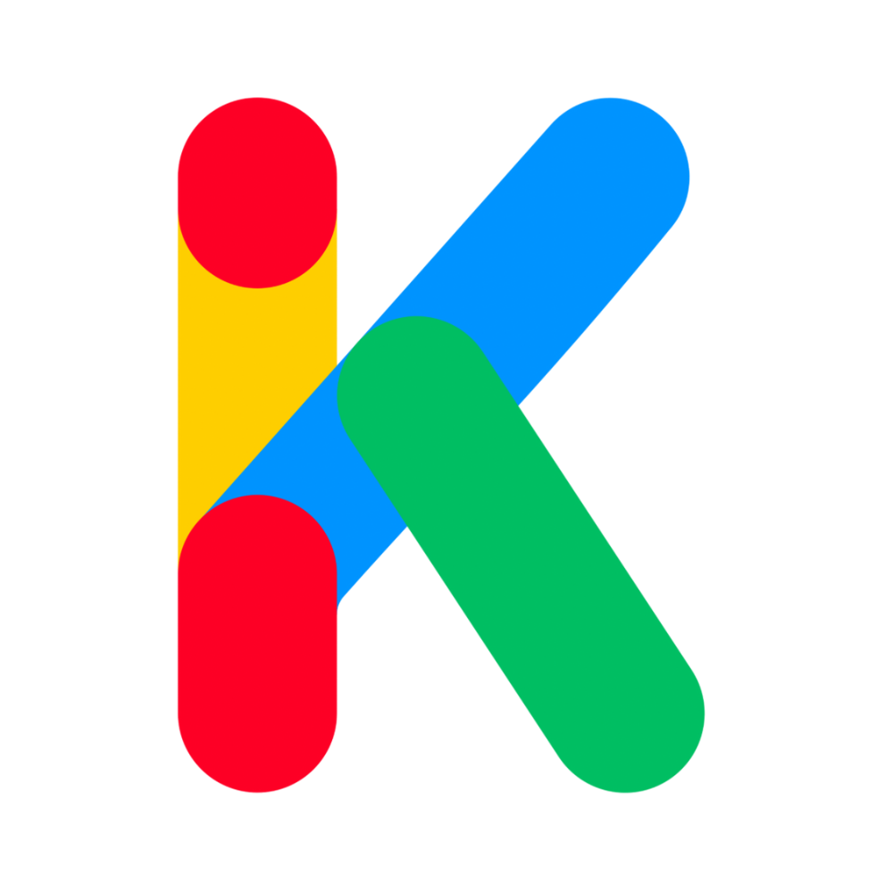

<h1>K Movie 🎬</h1>
<strong>A lightweight, responsive, and multi-language movie browser built with Vanilla JS and Tailwind CSS.</strong>

K Movie is a user-friendly single-page application for browsing a curated list of movies. Built with pure HTML, Tailwind CSS, and vanilla JavaScript, it offers a clean interface that works seamlessly across all devices, making it ideal for web apps, including those embedded within Telegram bots.🌟 Key Features📱 Fully Responsive: Adapts perfectly to mobile, tablet, and desktop screens.🌍 Multi-language Support: Easily switch between Kurdish, Turkish, and English with a modern, flag-based dropdown menu.🔍 Live Search: Instantly find movies by title or description as you type.🎨 Advanced Genre Filtering: A sleek, slide-out menu allows users to filter the movie catalog by one or more genres.⚡ Dynamic UI Rendering: The entire interface is rendered using vanilla JavaScript, ensuring a fast and smooth user experience without a heavy framework.🎬 Interactive Movie Cards: Movie posters are displayed in a modern "banner" style. Clicking a card opens a modal with detailed information.↔️ Swiper.js Integration: Movies are organized into categories with smooth, touch-friendly carousels.🛠️ Tech StackHTML5: For the core structure of the application.Tailwind CSS: For a utility-first approach to styling, enabling rapid and responsive UI development.Vanilla JavaScript (ES6+): For all dynamic functionality, including rendering, searching, filtering, and event handling.Swiper.js: For creating beautiful and responsive carousels.🚀 Getting StartedThis project is a single-file application, which makes it incredibly simple to set up and run. No complex dependencies or build steps are required.1. Clone the RepositoryClone the repository or download the source code to your local machine.git clone https://your-repository-url.com/k-movie.git
2. Navigate to Directorycd k-movie
3. Add Your LogoEnsure you have the logo image at the correct path: assets/images/logo.png.4. LaunchSimply open the index.html file in your favorite web browser. That's it!🔧 How to CustomizeAdding new movies or categories is straightforward.Open the index.html file in a code editor.Navigate to the <script> tag at the bottom of the file.Find the state.movies object.You can add a new category or add a new movie object to an existing category. Follow the existing JSON structure for each movie:// Example of adding a new movie to the 'classics' category
classics: [
    // ... existing movies
    { 
        id: 'new-movie-id', 
        titles: { 
            ku: 'Navê Fîlmê', 
            tr: 'Film Adı', 
            en: 'Movie Title' 
        }, 
        link: 'https://your-telegram-link.com/...',
        descriptions: { 
            ku: 'Danasîna fîlmê...', 
            tr: 'Filmin açıklaması...', 
            en: 'The movie description...' 
        }, 
        genres: { 
            ku: 'Cure 1, Cure 2', 
            tr: 'Tür 1, Tür 2', 
            en: 'Genre 1, Genre 2' 
        } 
    },
]
📄 LicenseThis project is licensed under the MIT License. See the LICENSE file for more details.
Project created by <strong>@LiraKurdi</strong>

